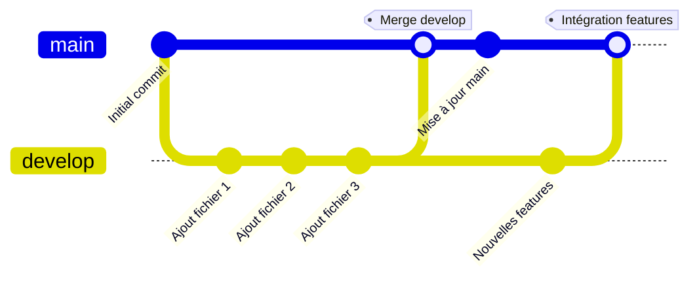

# Hayji - DevOps

## Table des matières

- [Installation](#installation)
- [Configuration Git](#configuration-git)
- [Commandes Git utilisées](#commandes-git-utilisées)
- [Workflow Git](#workflow-git)
- [Ressources](#ressources)

---

## Installation

### Prérequis

Installer Git et GitHub CLI sur votre machine.

### Étapes d'installation

```bash
# Naviguer vers le dossier du projet
cd /chemin/vers/ton/dossier

# Initialiser le dépôt Git
git init

# Authentification GitHub CLI
gh auth login
```

---

## Configuration Git

### Première configuration du dépôt

```bash
# Créer le fichier README initial
echo "# Hayji" >> README.md

# Initialiser Git (si pas déjà fait)
git init

# Ajouter le README au suivi Git
git add README.md

# Premier commit
git commit -m "first commit"

# Renommer la branche principale en 'main'
git branch -M main

# Ajouter le dépôt distant
git remote add origin git@github.com:cesi14950/Hayji.git

# Pousser vers le dépôt distant
git push -u origin main
```

### Workflow sur une branche de développement

```bash
# Ajouter tous les fichiers modifiés
git add .

# Créer un commit avec message
git commit -m "Ajout de nouveaux fichiers sur develop"

# Pousser vers la branche develop
git push -u origin develop

# Basculer vers la branche main
git switch main

# Fusionner develop dans main
git merge develop
```

---

## Commandes Git utilisées

| Commande | Description |
|----------|-------------|
| `cd /chemin/vers/ton/dossier` | Naviguer vers le répertoire du projet |
| `git init` | Initialiser un nouveau dépôt Git local |
| `gh auth login` | Authentifier GitHub CLI avec votre compte GitHub |
| `echo "# Hayji" >> README.md` | Créer un fichier README.md avec un titre |
| `git add README.md` | Ajouter le fichier README au suivi Git |
| `git add .` | Ajouter tous les fichiers modifiés au staging |
| `git commit -m "message"` | Créer un commit avec un message descriptif |
| `git branch -M main` | Renommer la branche actuelle en 'main' |
| `git remote add origin <url>` | Ajouter un dépôt distant nommé 'origin' |
| `git push -u origin main` | Pousser et définir le suivi de la branche main |
| `git push -u origin develop` | Pousser et définir le suivi de la branche develop |
| `git switch main` | Basculer vers la branche main |
| `git merge develop` | Fusionner la branche develop dans la branche actuelle |

---

## Workflow Git

### Diagramme du flux de commit avec branches



### Description du workflow

1. **Branche main** : Branche principale contenant le code stable
2. **Branche develop** : Branche de développement pour les nouvelles fonctionnalités
3. **Workflow** :
   - Développer sur `develop`
   - Commiter régulièrement les changements
   - Fusionner `develop` dans `main` quand les features sont prêtes
   - La branche `main` reste toujours stable

---

## Ressources

### Documentation GitHub

- [GitHub - Configurer Git](https://docs.github.com/fr/get-started/quickstart/set-up-git)
- [GitHub - À propos des dépôts distants](https://docs.github.com/fr/get-started/getting-started-with-git/about-remote-repositories)
- [GitHub - Créer un dépôt](https://docs.github.com/fr/get-started/quickstart/create-a-repo)
- [GitHub - Utilisation des branches](https://docs.github.com/fr/pull-requests/collaborating-with-pull-requests/proposing-changes-to-your-work-with-pull-requests/about-branches)
- [GitHub CLI - Documentation](https://cli.github.com/manual/)
- [Git - Documentation officielle](https://git-scm.com/doc)
- [GitHub - Fork et Pull Request](https://docs.github.com/fr/pull-requests/collaborating-with-pull-requests/proposing-changes-to-your-work-with-pull-requests/creating-a-pull-request)

---
